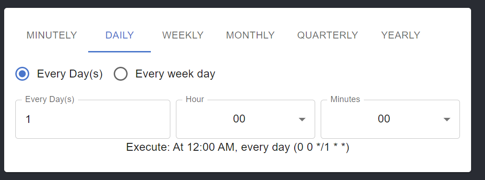
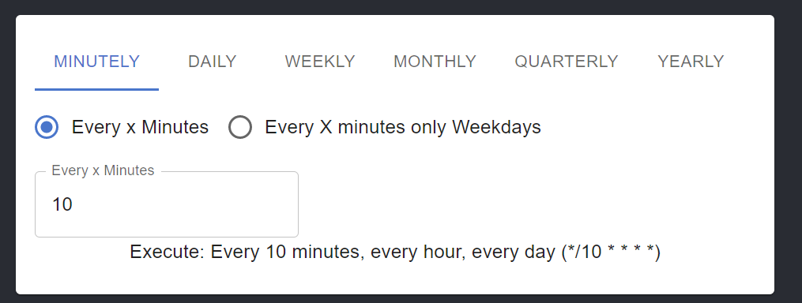
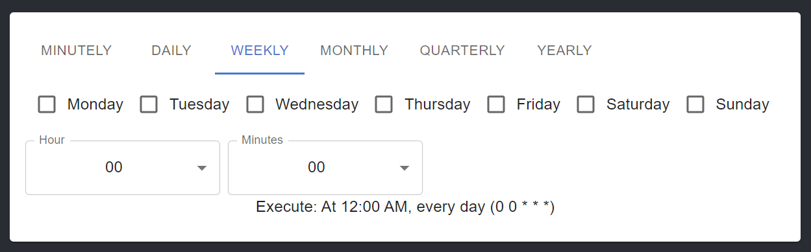

# React Cron Gnu generator

This is a React component for generating expressions for GNU CronTab using Material UI components. My final version will also cover the possibility of java cron expression. The use case where I use It, was to set up a periodical task to be executed using node-cron scheduler.

## List of features

- Posibility to use the human readable expression or the raw crontab expression.
- Different modes and options.
- Developed with hooks and material ui
- i18n Extensible

### Screenshoots







### How to use it

It is require to use React-intl package for internazionalization

```html
<IntlProvider messages="{cronMessages}" locale="en" defaultLocale="en">
  .....
  <Cron onChange="{handleOnChange}" showResultText showResultCron />
  <IntlProvider
/></IntlProvider>
```

It is possible to extend and translate to your desire locale doing the translation of the placeholders located
[here]("./src/component/Cron/components/cronMessages.js")

#### Props

showResultText (optional): (default True | False) if true will show the human readable text as part of the component
showResultCron (optional): (True | default False) if true will show the cron expression as part of the component
value (optional): the value for setting up the initial state.

onChange (required): (function) which receives 3 parameters

```javascript
const handleOnChange = (cronExpression, humanReadable, tab) => ....
```

cronExpression: Array where every single component it will be the cron expression part `[minute, hour, day(month), month, day(week) ]`
humanReadable: String with the human readable cron expression.
tab: is the name of the tab selected

### Download & Installation

**npm**

```shell
npm i react-gnu-cron
```

**yarn**

```shell
yarn add react-gnu-cron
```

### i18n extensible

It is possible to extend and translate to your desire locale doing the translation of the placeholders located
[here]("./src/component/Cron/components/cronMessages.js")


### Contributing

Keep it simple. Keep it minimal. Don't put every single feature just because you can. Feel free to open PR to be reviewed

### Authors or Acknowledgments

- Ariel Epelman
- This project was a total refactor of this one. <https://sojinantony01.github.io/react-cron-generator/>

### License

This project is licensed under the MIT License
